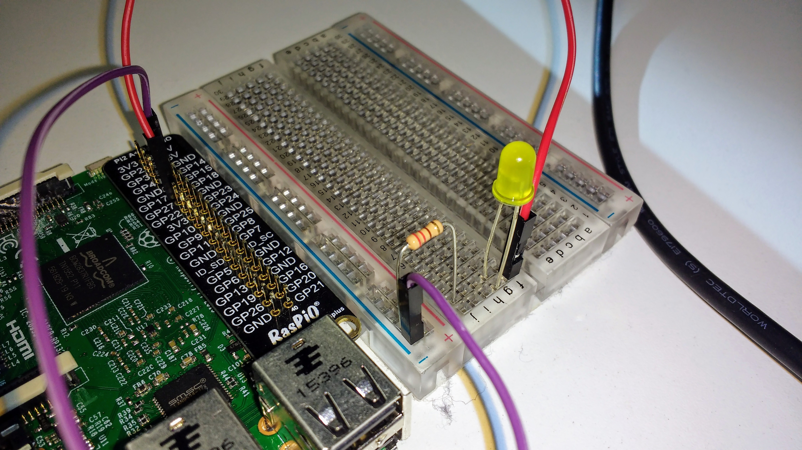
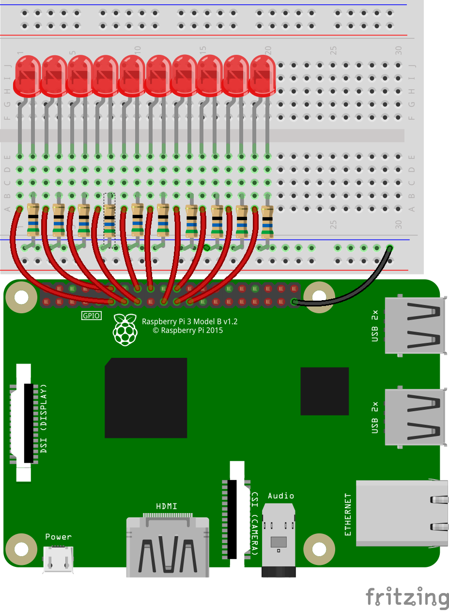

## Setting up the LEDs

You are going to need to connect ten LEDs to your Raspberry Pi, each one to a separate numbered GPIO pin. It doesn't really matter which GPIO pins you use, but make sure that each one has been protected with a suitable resistor.

You can see how to connect a single LED to a Raspberry Pi using a breadboard in this section:

[[[generic-physical-led-calcs]]]

If you want to find out how to choose a suitable resistor for your LEDs, check out this section:

[[[rpi-physical-connect-led]]]

--- hints --- --- hint ---
You'll notice that, while you have plenty of GPIO pins to use, you have a limited number of ground pins (labelled **GND**). You can actually use a single **GND** pin if you connect it to one of the long rails of the breadboard, with each resistor feeding into that rail.

You can test each LED is working by connecting it to the **3V3** pin on the Raspberry Pi, before choosing a GPIO pin for it.
--- /hint --- --- hint ---
Here's one way a single LED could be connected using the common ground rail:

--- /hint --- --- hint ---
Here you can see all the LEDs being wired up, along with a schematic of one way of putting everything together. Each LED is tested using the **3V3** pin before it is connected to a GPIO pin.

--- /hint --- --- /hints ---
