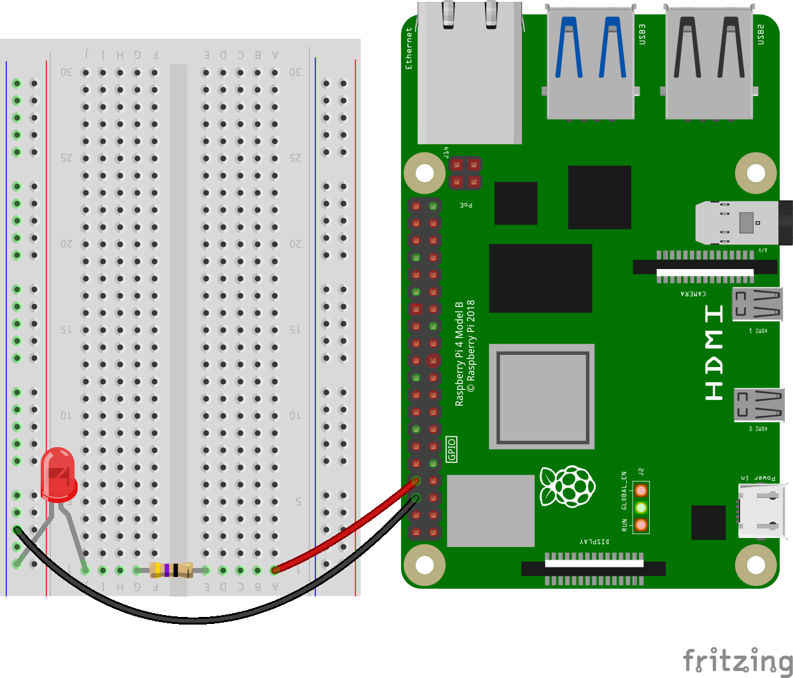
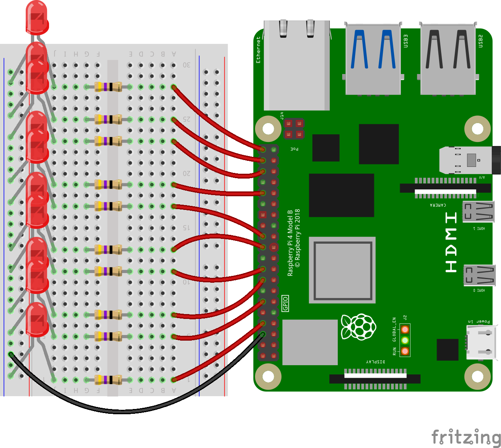

## Setting up the LEDs

--- task ---
+ Connect an LED to one of your Raspberry Pi's GPIO pins, using a breadboard and a resistor. The shorter leg of the LED should be connected to the ground rail (-) of your breadboard.

--- /task ---

--- task ---
+ Now connect another 9 LEDs, following the same pattern. Each new LED should be connected to the ground rail, and a different numbered GPIO pin. 

--- /task ---