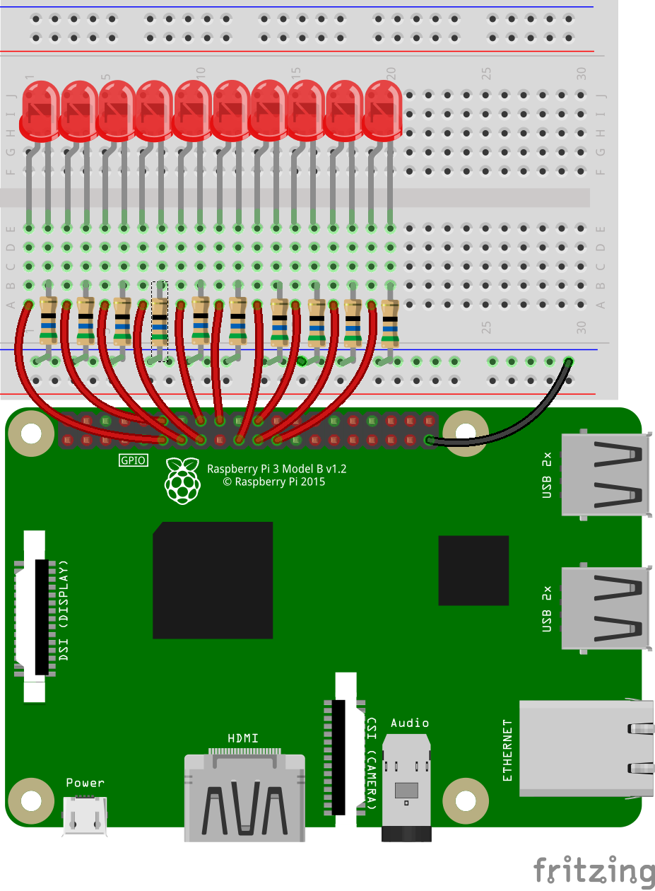

## Testing your LEDs

In the previous section, you connected your LEDs to your Raspberry Pi, and hopefully tested that each one works using the **3V3** pin. Now you are going to test that you can control each LED with code.

- Make sure you have the file open on which you were working earlier. It should look something like this:

	```python
	import requests

	url = "http://api.open-notify.org/astros.json"
	r = requests.get(url)
	data = r.json()
	people = data['number']
	```

- Start by importing the code you need to control LEDs using Python:

	```python
	import requests
	from time import sleep
	from gpiozero import LEDBarGraph

	url = "http://api.open-notify.org/astros.json"
	r = requests.get(url)
	data = r.json()
	people = data['number']
	```

- You need to create an LED Bar Graph object containing all the GPIO pins you are using. Make sure your pin numbers are in the same order you have used to wire them to the breadboard. For example, you may have wired your LEDs as shown in the following schematic:
  
  In that case, your code should look like this:

	```python
	leds = LEDBarGraph(17, 18, 27, 22, 23, 24, 10, 25, 9, 11)
	```

- Test your LEDs using the `on` method. This, for instance, will turn on all the LEDs:

		```python
		leds.on()
		```

- To light up half your LEDs (5 out of 10 LEDs), set the bar graph value to the fraction of LEDs you want lit:

	```python
	leds.value = 5/10
	```
	For the example above, instead of `5/10` you could also use `1/2` or `0.5`.

- Now, try other fractions to light up different numbers of LEDs.


- To test all the LEDs, you can create a loop that will turn on and off all the `LED` objects in the `leds` list. Once it's running, this should occur:

	```python
	for i in range(10):
	    leds.value = (i+1) / 8
			sleep(1)
	```

- Have a go at writing the test loop by yourself. Use the hints below if you need help.

--- hints --- --- hint ---
1. Import the `sleep` function from the time module
2. Use a `for` loop to go over each item in the `leds` list
3. Instruct each item to turn `on()`, then `sleep`, and then turn `off()`
--- /hint --- --- hint ---
Try and complete the code shown below.
```python
import requests
from gpiozero import LED
from time import sleep

pins = [17, 18, 27, 22, 23, 24, 10, 25, 9, 11]
leds = [LED(pin) for pin in pins]

url = "http://api.open-notify.org/astros.json"
r = requests.get(url)
data = r.json()
people = data['number']

for led in leds:
    ##turn on the led
    sleep(2)
	##turn off the led
```
--- /hint --- --- hint ---
Here's a video showing the code being written along with an explanation.
<iframe width="560" height="315" src="https://www.youtube.com/embed/HIXo7UGAJ1I" frameborder="0" allowfullscreen></iframe>
--- /hint --- --- /hints ---
