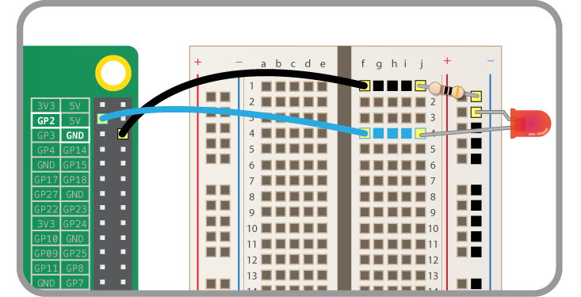
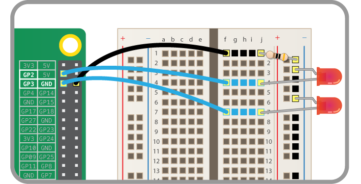

# People in Space Indicator

Use the Python requests module to access the *People in Space API* and create an indicator to show the number of people currently in space.

British ESA Astronaut Tim Peake will be going to the International Space Station on 15th December 2015 so this is a great activity to do in time for his arrival. As well as the scientific research Tim will be performing while in space, he's also going to be running experiments using Python code written by school students on two Raspberry Pis as part of the [Astro Pi](https://astro-pi.org) project.

## Browse the People in Space API

**API** stands for *Application Programming Interface*. One form of API is a Web API, which can be used to extract data from a service provided online. Some APIs are open to the public and provide data free of charge. Some APIs require a login to access them, which can be obtained with an application, or can be provided as a service to customers for a fee.

The purpose of providing data via an API is to allow people to access it for their own use, or to build programs with it. Some APIs provide business critical data sets, or otherwise important data about things like the weather financial activity, or even providing access to things like the Twitter stream or Fickr photographs from around the world. Other APIs are just for fun - like the [Pokemon API](http://pokeapi.co/), the [Star Wars API](http://swapi.co/) or the [Adventure Time API](http://adventuretimeapi.com/). While these APIs were made for fun, they can still be used in interesting and useful ways. You could build a Pokemon game in Minecraft, or build a quiz game about the characters in Adventure Time!

You're going to use the *[People in Space API](http://open-notify.org/Open-Notify-API/People-In-Space/)*, maintained and provided for free by [Nathan Bergey](http://open-notify.org/about).

1. Start by opening a web browser and navigating to the following URL:

    ```
    http://api.open-notify.org/astros.json
    ```

1. You should see a white page with some text like so:

    

    You are viewing the data provided by the API. This is the manual method of accessing the data.

1. Observe the data provided. It should look something like this:

    ```
    {
      "message": "success",
      "number": 6,
      "people": [
      {
        "craft": "ISS",
        "name": "Mikhail Kornienko"
      },
      ...
    }
    ```

    The format of this data is called **JSON** (pronounced "Jason") which stands for *JavaScript Object Notation*. While the name refers to the programming language *JavaScript*, it's a standard data-interchange format which is made to be portable between languages and applications. If you're familiar with Python's `dictionary` data structure, you'll see the similarities. In other languages a nested array could be used the same way.

1. Note that the API provides three pieces of data: `message`, `number` and `people`.

    - `message` is a single string containing the word `success`
    - `number` is the integer value `6`
    - `people` is an array of astronauts

1. Within the `people` array, there are six objects. Each object contains two pieces of data:

    - `craft` is the spacecraft on which the astronaut is present
    - `name` is the astronaut's full name

## Using Python's requests module

Now you'll use the `requests` module in Python to access the API.

1. Open Python 3 from the main menu:

    

1. In the Python shell, type the following line and press **Enter**:

    ```python
    >>> import requests
    ```

    (note the `>>>` is not typed, but denotes shell input)

    *You're using the Python shell's REPL (Read Evaluative Print Loop) which means each line is executed immediately, rather than writing a file, saving it and running all commands in one go*

1. Now create a variable containing the URL of the API, as a string:

    ```python
    url = "http://api.open-notify.org/astros.json"
    ```

1. Make a request to the API by entering:

    ```python
    r = requests.get(url)
    ```

1. Now simply type `r`, and press **Enter**. This is the same as typing `print(r)` in a file. The REPL allows you to quickly inspect objects this way. You should now see the following:

    ```
    <Response [200]>
    ```

    *This states that `r` contains a `Response` type object, and shows `200`. This is the status code of the request - which means "Success". Other status codes include `404` - which means "File not found" and `500` - "Server error".*

1. Now enter `help(r)`. This shows the docstring (documentation string) for the `Response` object. You should see:

    ```
    Help on Response in module requests.models object:

    class Response(builtins.object)
     |  The :class:`Response <Response>` object, which contains a
     |  server's response to an HTTP request.
     ...
    ```

1. Observe the section of the docstring headed `Data descriptors defined here`. You'll see a list of available properties and their descriptions, including:

    - `apparent_encoding`
    - `content`
    - `is_permanent_redirect`
    - `is_redirect`
    - `links`
    - `ok`
    - `text`

    These properties are essentially variables accessible within an object, For example, `r.ok` is a variable containing the success status of the request (`True` or `False`).

1. Try accessing some of these properties by entering them in the REPL:

    ```python
    >>> r.ok
    True
    >>> r.is_redirect
    False
    >>> r.text
    '{\n  "message": "success", \n  "number": 6...
    ```

    *You'll see that `r.text` seems to contain the data you need. However, this is provided as a string which makes it difficult to use.*

1. Observe the `Methods defined here` part of the docstring, which includes:

    ```
    json(self, **kwargs)
        Returns the json-encoded content of a response, if any.
    ```

    This allows you to access the content of the URL request as JSON, which will make it more useful.

    *A method is a function which belongs to an object, and is accessed the same way as a property but called like a function with `()`, i.e. `r.json()`*

1. Enter `r.json()`. You should see:

    ```
    {'number': 6, 'message': 'success', 'people': [{'craft': 'ISS', 'name': 'Mikhail Kornienko'}, {'craft': 'ISS', 'name': 'Scott Kelly'}, {'craft': 'ISS', 'name': 'Oleg Kononenko'}, {'craft': 'ISS', 'name': 'Kimiya Yui'}, {'craft': 'ISS', 'name': 'Kjell Lindgren'}, {'craft': 'ISS', 'name': 'Sergey Volkov'}]}
    ```

1. Save this as a variable:

    ```python
    j = r.json()
    ```

1. Check the data type of the new variable with `type(j)`

    ```python
    >>> type(j)
    <class 'dict'>
    ```

    You'll see that `j` is a dictionary, which is a very useful data structure in Python, essentially identical to the JSON format.

1. To access data inside a dictionary, index it by name with `[]`:

    ```python
    >>> j['number']
    6
    ```

    That's it!

1. Looking back and the commands used, putting it all together, the following code was required to retrieve the number of people in space:

    ```python
    import requests

    url = "http://api.open-notify.org/astros.json"

    r = requests.get(url)
    j = r.json()
    n = j['number']
    print(n)
    ```

## Adding LEDs

Next you'll connect some LEDs to the Pi's GPIO pins and use each of them to represent a person in space.

1. Start by using a male-to-female jumper wire to connect one of the Pi's ground pins to the breadboard's ground rail:

    

1. Now connect a single LED to the Pi by wiring it to the ground rail and pin 2, using a male-to-male wire, a male-to-female wire and a resistor:

    

1. Start by importing the LED class from the GPIO Zero library:

    ```python
    >>> from gpiozero import LED
    ```

1. Create an instance of an `LED` object on pin 2:

    ```python
    >>> led = LED(2)
    ```

1. Try lighting the LED:

    ```python
    >>> led.on()
    ```

    It should now be on!

1. Connect a second LED to pin 3:

    

1. Connect the rest of your LEDs (10 total) onto the successive pins (4, 14, 15, 17, 18, 27, 22, 23) in the same way.

1. Ensure your previously used LED on pin 2 is closed:

    ```python
    >>> led.close()
    ```

1. Create a list of the pin numbers you're using:

    ```python
    >>> pins = [2, 3, 4, 14, 15, 17, 18, 27, 22, 23]
    ```

1. Create a list of LEDs using these pin numbers:

    ```python
    >>> leds = [LED(pin) for pin in pins]
    ```

    *This is called list comprehension - generating a list in one line instead of using a traditional loop*

1. Inspect the `leds` list:

    ```python
    >>> leds
    [<gpiozero.LED object on pin=2, is_active=False>,
    <gpiozero.LED object on pin=3, is_active=False>,
    <gpiozero.LED object on pin=4, is_active=False>,
    <gpiozero.LED object on pin=14, is_active=False>,
    ...]
    ```

    *This prints out a representation of each object in the list, which shows some useful information.*

1. Test the `leds` list by turning them all on:

    ```python
    >>> [led.on() for led in leds]
    ```

    *This is another use of a list comprehension - running a command on every item in a list*

1. Turn them off:

    ```python
    >>> [led.off() for led in leds]
    ```

    *Tip: use `Alt + P` (previous) to go through your command history and edit the last command entered.*

## Make the indicator

Now you'll use the LEDs to display the number of people currently in space.

1. Now it's time to bring it all together in a file. Click `File > New File`.

1. Start by importing the libraries you've used:

    ```python
    from gpiozero import LED
    import requests
    ```

1. Add the LED setup:

    ```python
    pins = [2, 3, 4, 14, 15, 17, 18, 27, 22, 23]
    leds = [LED(p) for p in pins]
    ```

1. Add the `requests` code:

    ```python
    url = "http://api.open-notify.org/astros.json"

    r = requests.get(url)
    j = r.json()
    n = j['number']
    ```

1. Now rather than just printing `n`, you can use it to determine how many LEDs should be lit. Consider the following loop:

    ```python
    for led in leds:
        led.on()
    ```

    This allow you to access each LED in turn. However, we need to know at what point to stop turning them on.

1. You'll need to be able to compare the number in `n` to each LED number (order in the sequence - not GPIO pin number). You'll need to use the `enumerate` function to assign a number to each LED in sequence. See how `enumerate` works by trying it out in the shell (not the file):

    ```python
    >>> list(enumerate(leds))
    [(0, <gpiozero.LED object on pin=2, is_active=False>),
     (1, <gpiozero.LED object on pin=3, is_active=False>),
     (2, <gpiozero.LED object on pin=4, is_active=False>),
    ...]
    ```

    As you can see, this provides a list of the LEDs associated with index numbers starting from `0`.

1. Since `enumerate` returns two values (the *index number* and the *LED object*), you can loop over it and access both values by using `for i, led in enumerate(leds)`. Add the following loop to the code in your file:

    ```python
    for i, led in enumerate(leds):
        if n > i:
            led.on()
        else:
            led.off()
    ```

1. Save and run your code. Assuming the API returns `6`, you should have 6 LEDs light up!

1. You'll want to check the API for changes periodically. It's important to make sure you're not making too many requests to the API. Start by importing `sleep` by adding the import at the top of the file with the others:

    ```python
    from time import sleep
    ```

1. Now wrap the `requests` and `LED` code in a `while` loop to make it run continuously and keep updating the LEDs:

    ```python
    while True:
        r = requests.get(url)
        j = r.json()
        n = j['number']
        for i, led in enumerate(leds):
            if n > i:
                led.on()
            else:
                led.off()
        sleep(60)  # update every minute
    ```

    Ensure the sleep is added at the end so it waits 60 seconds between API calls to check the result every minute.

1. Run the code and it should always show the current number of people in space. Leave it running and it should update in the future, as astronauts are delivered to and from the International Space Station.

## Astronaut names

Finally, learn to get the astronaut names from the API call.

1. When you inspected the JSON object originally, as well as the *number* of people in space, it shows the names of all the astronauts. Return to the Python shell and inspect `j['people']` from the dictionary:

    ```python
    >>> type(j['people'])
    <class 'list'>
    >>> j['people']
    [{'craft': 'ISS', 'name': 'Mikhail Kornienko'}, {'craft': 'ISS', 'name': 'Scott Kelly'}, {'craft': 'ISS', 'name': 'Oleg Kononenko'}, {'craft': 'ISS', 'name': 'Kimiya Yui'}, {'craft': 'ISS', 'name': 'Kjell Lindgren'}, {'craft': 'ISS', 'name': 'Sergey Volkov'}]
    ```

1. You can see that `j['people']` is a list. Now inspect the list further:

    ```python
    >>> len(j['people'])
    6
    >>> type(j['people'][0])
    <class 'dict'>
    >>> j['people'][0]
    {'craft': 'ISS', 'name': 'Mikhail Kornienko'}
    ```

1. You can see that the list contains 6 elements, and that each element is another dictionary. All that's left is accessing the individual elements within the dictionary:

    ```python
    >>> type(j['people'][0]['craft'])
    <class 'str'>
    >>> j['people'][0]['craft']
    'ISS',
    >>> type(j['people'][0]['name'])
    <class 'str'>
    >>> j['people'][0]['name']
    'Mikhail Kornienko'
    >>> j['people'][1]['name']
    'Scott Kelly'
    ```

1. Try printing out all the astronaut names:

    ```python
    >>> for astronaut in j['people']:
            print(astronaut['name'])

    Mikhail Kornienko
    Scott Kelly
    Oleg Kononenko
    Kimiya Yui
    Kjell Lindgren
    Sergey Volkov
    ```

1. Now return to your code and add a line to save the list of astronauts as a variable after saving `n`:

    ```python
    n = j['number']
    astronauts = j['people']
    ```

1. Inside the `if n > i` statement, after `led.on()`, add two lines to print the astronaut name and then sleep for 1 second in order to pause between each light coming on:

    ```python
    if n > i:
        led.on()
        print(astronauts[i]['name'])
        sleep(1)
    ```

1. Run the code again and the LEDs should come on one at a time, with the astronaut's name printed out at the same time.

## Important dates

Note the following dates of planned delivery of astronauts on the International Space Station:

- **15 December 2015** - Tim Peake, Yuri Malenchenko and Timothy Kopra
- **18 March 2016** - Aleksey Ovchinin, Oleg Skripochka, Jeffrey N. Williams
- **30 May 2016** - Anatoli Ivanishin, Takuya Onishi, Kathleen Rubins
- **30 September 2016** - Sergey N. Ryzhikov, Andrei Borisenko, Robert S. Kimbrough
- **30 November 2016** - Oleg Novitskiy, Thomas Pesquet, Peggy Whitson

## What next?

Now you've created a People in Space Indicator with LEDs - try expanding your project:

- Make a fancy display for your indicator
- Use an add-on board (with at least 9 LEDs) instead of individual LEDs
- Use an LED or LCD display to scroll the names of the astronauts (e.g [Sense HAT](https://www.raspberrypi.org/products/sense-hat/) or [Display-O-Tron HAT](https://shop.pimoroni.com/collections/raspberry-pi/products/display-o-tron-hat))
- Make an on-screen display of the number or astronaut names using [PyGame Zero](http://pygame-zero.readthedocs.org)
- Use `requests` with another API to look up information about each astronaut
