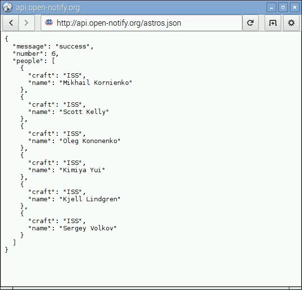

# People in Space Indicator

Use the Python requests module to access the *People in Space API* and create an indicator to show the number of people currently in space.

## Browse the People in Space API

**API** stands for *Application Programming Interface*. One form of API is a Web API, which can be used to extract data from a service provided online. Some APIs are open to the public and provide data free of charge. Some APIs require a login to access them, which can be obtained with an application, or can be provided as a service to customers for a fee.

The purpose of providing data via an API is to allow people to access it for their own use, or to build programs with it. Some APIs provide business critical data sets, or otherwise important data about things like the weather financial activity, or even providing access to things like the Twitter stream or Fickr photographs from around the world. Other APIs are just for fun - like the [Pokemon API](http://pokeapi.co/), the [Star Wars API](http://swapi.co/) or the [Adventure Time API](http://adventuretimeapi.com/). While these APIs were made for fun, they can still be used in interesting and useful ways. You could build a Pokemon game in Minecraft, or build a quiz game about the characters in Adventure Time!

We're going to use the *[People in Space API](http://open-notify.org/Open-Notify-API/People-In-Space/)*, maintained and provided for free by [Nathan Bergey](http://open-notify.org/about).

1. Start by opening a web browser and navigating to the following URL:

    ```
    http://api.open-notify.org/astros.json
    ```

1. You should see a white page with some text like so:

    

    You are viewing the data provided by the API. This is the manual method of accessing the data.

1.

## Access the API using Python and requests

## What next?
